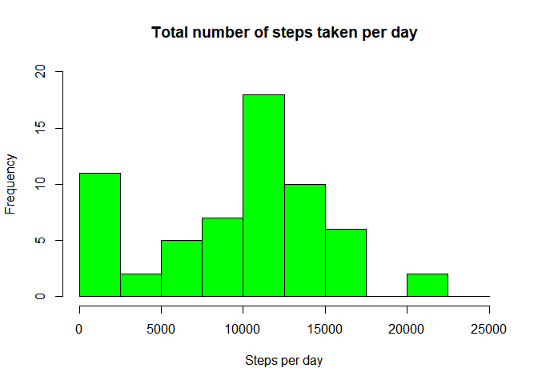
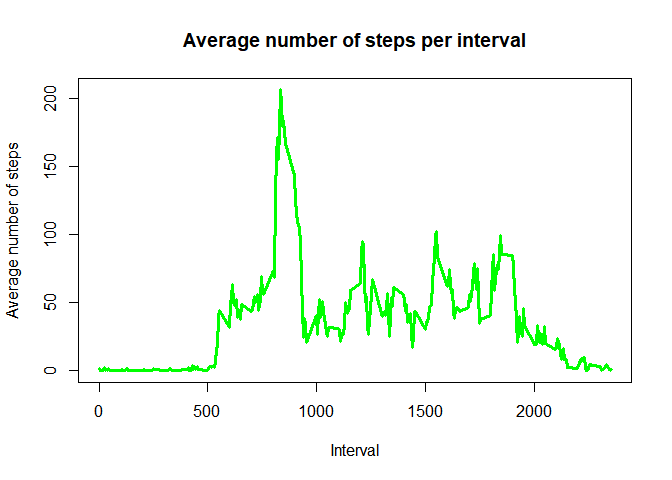
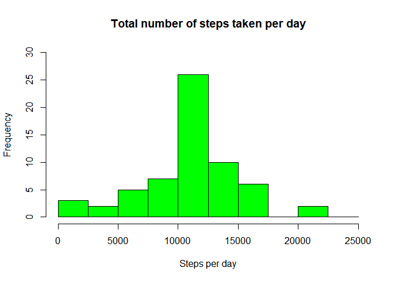
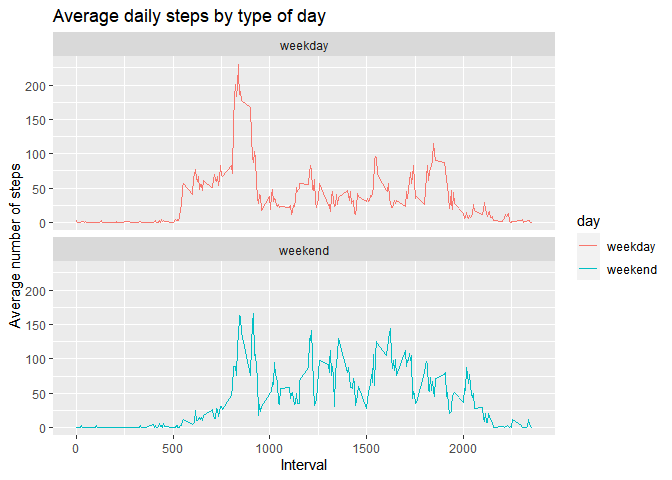

## 1. Introduction

This assignment makes use of data from a personal activity monitoring device. This device collects data at 5 minute intervals through out the day. The data consists of two months of data from an anonymous individual collected during the months of October and November, 2012 and include the number of steps taken in 5 minute intervals each day.


## 2. Loading and Pre-processing Data


```r
library(ggplot2)
library(dplyr)
```

```
## 
## Attaching package: 'dplyr'
```

```
## The following objects are masked from 'package:stats':
## 
##     filter, lag
```

```
## The following objects are masked from 'package:base':
## 
##     intersect, setdiff, setequal, union
```

```r
library(knitr)
activity <- read.csv("activity.csv")
head(activity,10)
```

```
##    steps       date interval
## 1     NA 01/10/2012        0
## 2     NA 01/10/2012        5
## 3     NA 01/10/2012       10
## 4     NA 01/10/2012       15
## 5     NA 01/10/2012       20
## 6     NA 01/10/2012       25
## 7     NA 01/10/2012       30
## 8     NA 01/10/2012       35
## 9     NA 01/10/2012       40
## 10    NA 01/10/2012       45
```

The dates in the given dataset are of class "Character". Here I converted them into class "Date".


```r
activity$date <- as.Date(strptime(activity$date, format="%d/%m/%Y"))
```


```r
names(activity)
```

```
## [1] "steps"    "date"     "interval"
```


```r
head(activity,10)
```

```
##    steps       date interval
## 1     NA 2012-10-01        0
## 2     NA 2012-10-01        5
## 3     NA 2012-10-01       10
## 4     NA 2012-10-01       15
## 5     NA 2012-10-01       20
## 6     NA 2012-10-01       25
## 7     NA 2012-10-01       30
## 8     NA 2012-10-01       35
## 9     NA 2012-10-01       40
## 10    NA 2012-10-01       45
```


```r
summary(activity)
```

```
##      steps             date               interval     
##  Min.   :  0.00   Min.   :2012-10-01   Min.   :   0.0  
##  1st Qu.:  0.00   1st Qu.:2012-10-16   1st Qu.: 588.8  
##  Median :  0.00   Median :2012-10-31   Median :1177.5  
##  Mean   : 37.38   Mean   :2012-10-31   Mean   :1177.5  
##  3rd Qu.: 12.00   3rd Qu.:2012-11-15   3rd Qu.:1766.2  
##  Max.   :806.00   Max.   :2012-11-30   Max.   :2355.0  
##  NA's   :2304
```


```r
str(activity)
```

```
## 'data.frame':	17568 obs. of  3 variables:
##  $ steps   : int  NA NA NA NA NA NA NA NA NA NA ...
##  $ date    : Date, format: "2012-10-01" "2012-10-01" ...
##  $ interval: int  0 5 10 15 20 25 30 35 40 45 ...
```


## 3. Total number of steps taken per day

Calculating total number of steps taken per day.

```r
activity_total_steps <- with(activity, aggregate(steps, by = list(date),
                                                 FUN = sum, na.rm = TRUE))
names(activity_total_steps) <- c("date", "steps")
```

Plotting the total number of steps taken per day.

```r
hist(activity_total_steps$steps, main = "Total number of steps taken per day",
     xlab = "Steps per day", col = "green", ylim = c(0,20), 
     breaks = seq(0,25000, by=2500))
```

<!-- -->

Calculating the mean and median of the total number of steps taken per day.

```r
mean_steps <- round(mean(activity_total_steps$steps), 3) 
median_steps <- round(median(activity_total_steps$steps),  3)
```

The mean of the total number of steps taken is 9354.23.
The median of the total number of steps taken is 1.0395\times 10^{4}.


## 4. Average daily activity pattern

Calculating the average number of steps taken over a speific 5-minute interval over 2 months.

```r
average_daily_activity <- aggregate(activity$steps, by=list(activity$interval),
                                    FUN=mean, na.rm=TRUE)
names(average_daily_activity) <- c("interval", "mean")
```

Plotting the average number of steps taken over a speific 5-minute interval over 2 months.

```r
plot(average_daily_activity$interval, average_daily_activity$mean,
     type = "l", col="green", lwd = 3, xlab="Interval", 
     ylab="Average number of steps", main="Average number of steps per interval")
```

<!-- -->


```r
max_average <- average_daily_activity[which.max(average_daily_activity$mean), ]$interval
```
The 5-minute interval, on average across all the days in the dataset, that contains the maximum number of steps is 835.


## 5. Imputing missing values

Calulating total no.of missing values(NA) in the dataset.

```r
total_na <- sum(is.na(activity))
```

Storing the indices of missing values in variable missing_value.

```r
missing_value <- which(is.na(activity$steps) == TRUE)
```

To substitute the missing values, I am going to use the mean activity in the same 5-minute interval as that of each of the missing value. 

For this I will use intervals and mean from the average_daily_activity variable.This variable contain 288 intervals which are recurrent in the dataset. So, I have created a function "n1" which takes the indices from "missing_value" as input and returns the respective interval of the indices out the 288 possible intervals.


```r
n1 <- function(x){
  if(x%%288 == 0) {
    v <- 288
  } else {
    v <- x%%288
  }
  r <- average_daily_activity$mean[ average_daily_activity$interval == activity$interval[v]]
  return(r)
}
```

"Data" is the new dataset that is equal to the original dataset but with the missing data filled in.
Using the "n1" function and indices from "missing_value", I filled in data in the place of missing values(NA) 

```r
data <- activity
for(i in missing_value){
  data$steps[i] <- n1(i)
}
```

## 6. Repeating step 3 for new dataset "data"


```r
data_total_steps <- with(data, aggregate(steps, by = list(date),
                                         FUN = sum, na.rm = TRUE))
names(data_total_steps) <- c("date", "steps")
hist(data_total_steps$steps, main = "Total number of steps taken per day",
     xlab = "Steps per day", col = "green", ylim = c(0,30), 
     breaks = seq(0,25000, by=2500))
```

<!-- -->


```r
mean_steps_data <- round(mean(data_total_steps$steps), 3)
median_steps_data <- round(median(data_total_steps$steps), 3)
```

The mean of the total number of steps taken is 1.0766189\times 10^{4}.
The median of the total number of steps taken is 1.0766189\times 10^{4}.

Calculating the impact of imputing data on the mean and median of the total number of steps taken.

```r
impact_mean <- mean_steps_data - mean_steps
impact_median <- median_steps_data - median_steps
```
The impact on mean of the total number of steps taken is 1411.959 i.e mean increased by 1411.959.
The impact on median of the total number of steps taken is 371.189 i.e median increased by 371.189.


## 7. Differences in activity patterns between weekdays and weekends

Created a new factor variable in the dataset with two levels - "weekday" and "weekend" indicating whether a given date is a weekday or weekend day.

```r
data$day <- weekdays(data$date)
for (i in 1:nrow(data)) {
  if (data[i,]$day %in% c("Saturday","Sunday")){
    data[i,]$day <- "weekend"
  }else{
    data[i,]$day <- "weekday"
  }
}
```

Panel plot containing a time series plot of the 5-minute interval (x-axis) and the average number of steps taken, averaged across all weekday days or weekend days (y-axis).

```r
data_by_day <- aggregate(steps~interval + day, data, mean, na.rm = TRUE)

plot <- ggplot(data_by_day, aes(x = interval , y = steps, color = day)) +
  geom_line() +
  labs(title = "Average daily steps by type of day", x = "Interval", y = "Average number of steps") +
  facet_wrap(~day, ncol = 1, nrow=2)
print(plot)
```

<!-- -->
